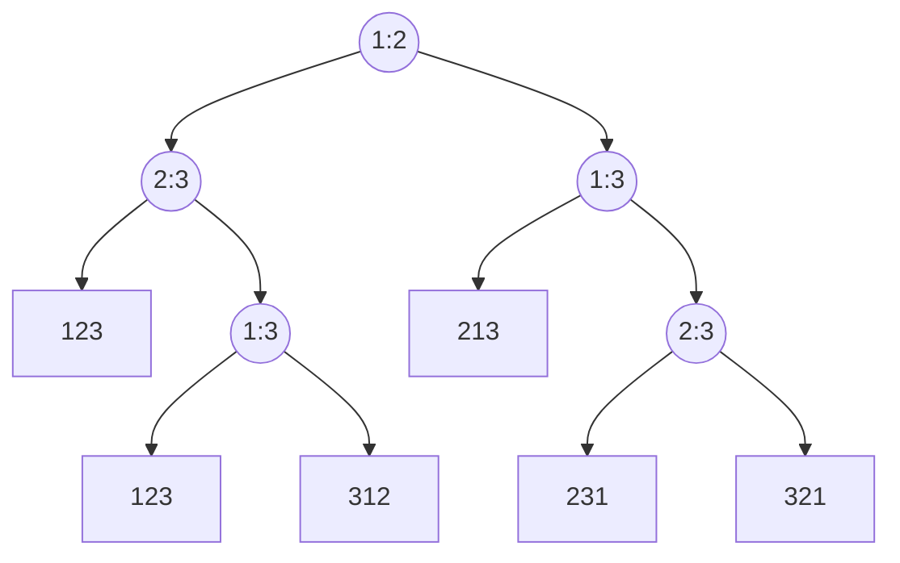

# 基于比较排序上界

前文提到的归并排序/快速排序/冒泡排序等等有一个相同的特征: 最终排序的结果中元素的顺序取决于算法中比较的结果.

因此这一节尝试求解这个问题: 基于比较的排序最快的上界是什么?

## 比较决策树

决策树,第一次接触是在机器学习中...不过非彼决策树..

例子输入 $<a_1,a_2,a_3>$,进行基于比较的排序.

决策树如下图:

- 叶子节点代表一个排序结果
- 非叶节点代表一个比较过程
- 非叶节点的左子树代表 $\leq$ (都行)
- 非叶节点的右子树代表 $>$ (都行)

对于输入为 n = 3 的比较排序而言,可能的结果有 $3!=6$种.叶子节点数 = 6.

其次叶节点到根节点的高度就是比较的次数.这里是最少 2 次,最多 3 次.

基于比较的算法

- 设输入规模为 n
- 设算法本身是确定算法

条件

- 决策树的叶节点数量 = $n!$,
- 决策树是二叉树.

有 

- $n! \leq 2^h$,两边取 $lg$
- $h \geq \lg(n!)$
- 根据斯莱特
