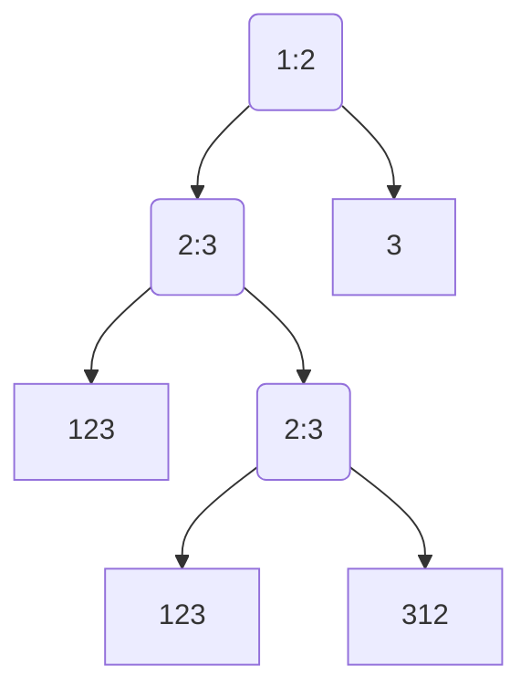

# 基于比较排序上界

前文提到的归并排序/快速排序/冒泡排序等等有一个相同的特征: 最终排序的结果中元素的顺序取决于算法中比较的结果.

因此这一节尝试求解这个问题: 基于比较的排序最快的上界是什么?

## 比较决策树

决策树,第一次接触是在机器学习中...不过非彼决策树..

例子输入 $<a_1,a_2,a_3>$,进行基于比较的排序:

```mermaid
graph TD
1(1:2) --> 2
1 --> 3
2(2:3) --> 4[123]
2 --> 5(2:3)
5 --> 8[123]
5 --> 9[312]
```

