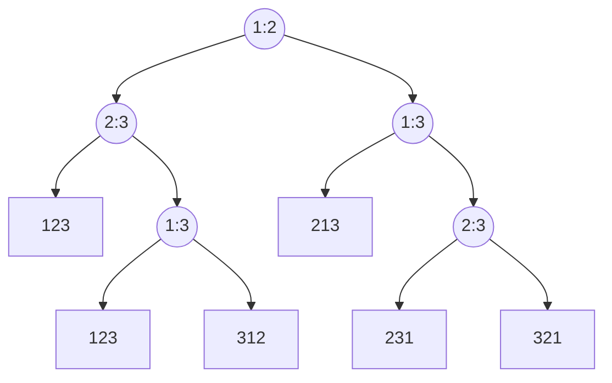

# 基于比较排序下界

前文提到的归并排序/快速排序/冒泡排序等等有一个相同的特征: 最终排序的结果中元素的顺序取决于算法中比较的结果.

因此这一节尝试求解这个问题: 基于比较的排序最坏情况下的下界是什么?

## 比较决策树

决策树,第一次接触是在机器学习中...不过非彼决策树..

例子输入 $<a_1,a_2,a_3>$,进行基于比较的排序.

暂时假设都是稳定的排序算法

决策树如下图:

- 叶子节点代表一个排序结果
- 非叶节点代表一个比较过程
- 非叶节点的左子树代表 $\leq$ (都行)
- 非叶节点的右子树代表 $>$ (都行)

对于输入为 n = 3 的比较排序而言,可能的结果有 $3!=6$种.叶子节点数 = 6.

其次叶节点到根节点的高度就是比较的次数.这里是最少 2 次,最多 3 次.

基于比较的算法

- 设输入规模为 n
- 设算法本身是确定算法

条件

- 决策树的叶节点数量 = $n!$,
- 决策树是二叉树.

有 

- $n! \leq 2^h$,两边取 $lg$
- $h \geq \lg(n!)$
- 根据斯莱特公式,只取最高阶有 $n! \geq (\frac{n}{e})^n$,且 $lg$ 是递增函数,带回上一步结果.
- $h \geq \lg(n!) \geq \lg((\frac{n}{e})^n)$,继续化简
- $h \geq n\lg(n) - n\lg(e)$
- 因此可以得出基于比较的稳定排序算法,最好情况下时间复杂度为 $\Omega(n\lg(n))$

基于比较的随机排序算法,可能对应的并非一颗决策树,当以上基于决策树高度的结论依旧成立.

## 结论

基于比较的排序算法,最坏情况下的下界是 $O(n\lg(n))$

还有一个推论: 堆排序和归并排序都是渐近最优的

- 渐近最优是当 n -> 无穷时,任何输入的时间复杂度上界是 $O(n\lg(n))$.