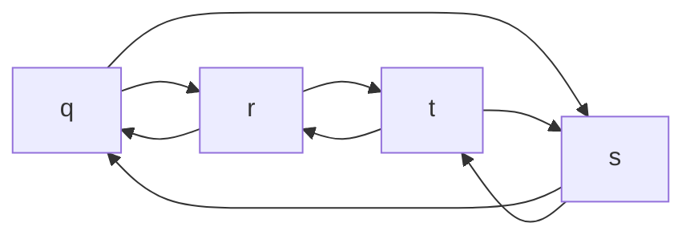

# 动态规划

动态规划: 将原问题分解为简单子问题求解的方法.

- 最优子结构: 原问题的最优解包含子问题
- 重叠子问题: 递归算法反复求解相同的子问题

算法导论提到的经典问题

- 钢条切割
- 矩阵链乘
- [[最长公共子序列#动态规划]]

## 最优子结构

原问题的最优解包含子问题.这样就能将复杂的原问题分解再分解,直到可以简单求解,最后出原问题的答案.

分解后子问题越简单越好求解.

- 对于钢条切割,固定一端,只需要 总长 i 下对应最优解.
- 矩阵链乘 和 [[最长公共子序列#最长公共子序列的特征|LCS]] 相反,两端不能固定,子问题定义需要求解两端.

一个问题是否具有最优子结构要非常慎重,需要严谨证明.看下面两个问题.

### 无权最短/长路径

给定有向图和两个顶点 u v

- 求无权最短路径: u 到 v 边数最少的路径.
- 求无权最长路径: u 到 v 边数最多的路径.

最短路径可以简单的证明,子问题具有最优子结构.

但是无权最长路径并不具有这一性质.

图渲染的不太好/./.

q -> s 的最长路径是 q-r-t-s.但是对于中间的 r t 而言,并不是 r-t 并不是 r -> t 的无权最长路径.

最优子结构对子问题有一个重要的要求是: 子问题必须无关.

换句话说,子问题无关即不同的子问题不会占有相同的资源,不会有资源冲突.

对于无权最长路径,当  q-r-t-s 路径占有了 q s 两个节点时,中间的子问题 r --> t 就不能再使用 q s 两个节点构建路径了,因此无权最长路径的子问题是相关的,这个问题不具有最优子结构.

实际上无权最长路径是个 NP 完全问题,至今没有多项式时间的算法求解.

## 重叠子问题

一般从最优子结构都会得到一个递推公式(状态转移方程),从递归来看,当递归过程反复对相同的子问题求解,这就是重叠子问题.

重叠子问题的存在意味着可以保存一次结果,之后直接调用,省区大量重复计算.这是动态规划可以将时间复杂度降低一个数量级的主要原因.

## 算法

通常分析完优化子结构,重叠子问题,就可以正式构建动态规划的算法了.通常有两种:

- 自上而下递归 + 备忘
- 自下而上动态规划(正统)

通常在时间复杂度上,两者几乎没有区别.当子问题调用方式不同时,会有一些差异.

- 如果每个子问题都会至少被计算一次,自下而上会比比自上而下更快,他们的子问题计算查询时间相同,但是自下而上没有递归的时间和空间损失.
- 相反如果存在一些不必计算的子问题,自上而下会节省下计算这些子问题的时间.

动态规划说到底还是会搜索全部的解空间,只是不再计算重复子问题,来降低时间复杂度.
