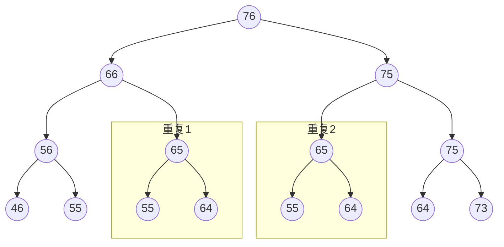

## 问题定义

子序列:

给定一个序列 $X[1..m]$,另一个序列 z 满足两个条件时称 Z 为 X 的子序列.

- $\forall z_j \in Z$,有 $x_i = z_j$.所有 Z 的元素都属于 X
- $z_{j1} = x_{i1},z_{j2} = x_{i2}$ , $i1 < i2$ 时,$j1 < j2$.Z 的所有元素在 X 的位置的前后顺序依旧保持不变.

给定两个序列 X Y,如果 Z 是 X 和 Y 共同的子序列,称 Z 是 XY 的公共子序列.

最长公共子序列: 给定两个序列 $X[1..m]$ 和 $Y[1..n]$ , 求 XY 最长的公共子序列.

最长公共子序列简称 LCS.

ps:

- 求公共子序列并非连续公共子序列,两者区别很大.
- 最长公共子序列的结果可能不唯一,但是其长度是相同的.

## 暴力搜索

暴力搜索的思路是将属于 X 的所有子序列都到 Y 中搜索一遍,最后确认	LCS.

子序列数量: 对于 $X[1..m]$ 中的每一个元素,都有两个选择,出现或者不出现在子序列中,因此最后子序列的数量是 $2^m$ 个,当然可能有重复的子序列.

每次到 $Y[1..n]$ 中搜索的成本是 $O(n)$

所以最后总的时间复杂度是 $O(n*2^m)$,指数级别直接 boom.

## 动态规划

### 定义

先规定一些定义.

- $\mid Z \mid$: 代表序列 Z 的长度.
- $LCS(X[1..m],Y[1..n])$: 代表 X Y 的公共子序列.
- $X + Y$: 代表将两个序列或元素合并为新的序列.

则可以得出以下定义

- $C[i,j] = | LCS(X[1..i],Y[1..j]) |$: 代表了 XY 最长公共子序列的长度.
- $Z[1..k] = LCS(X[1..m],Y[1..n])$: Z 是 XY 的最长公共子序列之一.

### 最长公共子序列的特征

直观上想,所有非暴力的解法都是寻得了问题的某些特征,利用这些特征省去了大量计算过程.

动态规划与分治法相同,都是不断将问题分解,最后串起子问题得到原问题的解.

对于 $C[i,j]$ 我们可以得出以下结论 ^9bfe6c

$$ C[i,j] =
\begin{cases}
C[i-1,j-1] & X[i] = Y[j] & (1)\\
Max\{C[i-1,j],C[i,j-1]\} & X[i] \neq  Y[j] & (2)
\end{cases}
$$

证明

1. $X[i] = Y[j]$ 时.
   1. 假设 $\exists W = LCS(X[1..i-1],Y[1..j-1])$,且 $|W| > k-1$.
   2. $W + X[i]$ (or $Y[j]$),将会是 XY 的公共子序列,且 $|W + X[i]| > k$.
   3. 与 Z 是最长公共子序列,长度为 k 矛盾.因此原命题成立.
   4. 这实际上是剪贴法,反例证明.
2. $X[i] \neq  Y[j]$ 时
   1. 这里只说明 $Z[k] \neq X[i]$ 情况,另一种情况类型相似.
   2. 如果  $Z[k] \neq X[i]$ 则 Z 一定是 $X[1..i-1]$ 和 Y 的最长公共子序列.
   3. 假设存在 W 是 $X[1..i-1]$ 和 Y 的 LCS 且 $|W| > |Z|$,则 W 也将是 X Y 的 LCS
   4. 这与前提条件不符,假设不成立.

这里证明了递推公式,现在如果直接进行递归计算呢?

## 递归

### 直接递归

我们假设 m=7 n=6,查看直接递归的递归树(部分).

递归树特点

- 二叉树,非满.
- 树的高度是 h = m + n
- 有许多子问题被重复计算了.

m n 很大时,直接递归的时间复杂度是 $O(2^{m+n})$ --> BOOM !

### 记录子问题结果递归

大量子问题被重复计算了,可以维持一个空间记录已求解子问题答案,直接直接查询.

对于 LCS 而言,子问题的解空间是 $m*n$.

因此记录+递归的复杂度

- 时间复杂度 $O(mn)$
- 空间复杂度 $O(mn)$

## 自底向上

与递归不同,还有一种自底向上的真动态规划.

LCS 子问题的解空间是 $\Theta(m*n)$.因此参考递归的逆过程,直接自底向上,从计算最小的子问题开始,直到最终计算出原问题.

下图展示了这一过程

- 一行一行的计算子问题,直到完成求解

![[Pasted image 20210328202613.png]]

时间复杂度

- 每个表项的计算是 $\Theta (1)$
- 最终整个计算过程是有 $m*n$ 个
- 最终的时间复杂度是 $\Theta m*n$
- 空间复杂度是 $\Theta (m*n)$

### 构建 LCS

上面计算的问题结果是 LCS 的长度,而不是 LCS 本身.因此求解原问题还差一步.

其实构建 LCS 的步骤并不复杂

- 记录-递归,需要记录每次有效选择.
- 自底向上,需要记录每次有效选择.上图展示的就是自底向上构建 LCS 的过程.
- LCS 不唯一...

## 算法改进

主要是空间上的改进

回到自底向上计算过程,实际参与计算是只是 $m*n$ 表的两行,因此只需要保存这两行即可.

当然这样要构建 LCS,就不能事后构建了,只能运行算法同时,记录选择的结果.

看 m or n 那个小,作为行运算.
